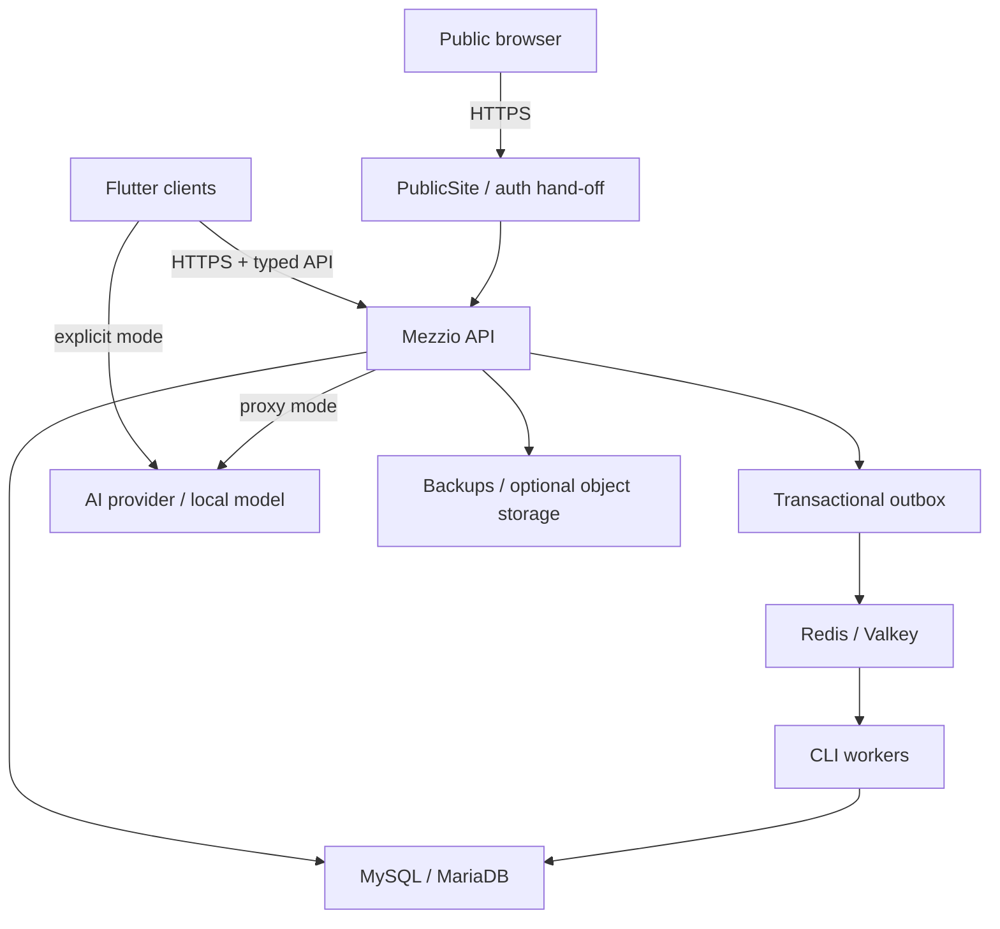

# Providentia Phase 0 threat model

**Status:** Accepted Phase 0 security baseline; controls require implementation evidence

**Method:** Asset/trust-boundary analysis with abuse cases, preventive controls, test evidence, and explicit residual risk

**Baseline:** OWASP API Security, Authorization, and Multi-Tenant Security guidance referenced by the V1 master prompt

## 1. Scope and security objectives

This model covers the planned Flutter clients, public Mezzio site, authenticated API, browser authentication hand-off, modular backend, database, Redis/Valkey queue, workers, optional object storage, AI provider adapters, deployment secrets, backup/restore, catalog administration, support access, imports, and synchronization.

Primary objectives:

1. A home can never read or mutate another home's private data.
2. Platform and catalog roles do not imply private household access.
3. Offline retries and asynchronous delivery never duplicate authoritative changes.
4. Media and AI credentials follow the selected privacy mode exactly.
5. Untrusted text, files, models, providers, queues, imports, and clients cannot cross application trust boundaries without validation and authorization.
6. Audit, backup, export, deletion, and recovery preserve confidentiality and integrity.

This is a design-time model. Residual risk remains until Phase 1+ controls are implemented and independently tested.

## 2. Assets

| Asset class | Examples | Security requirement |
|---|---|---|
| Identity and authentication | Password hashes, email-verification state, MFA material, device sessions, refresh-token hashes | Confidentiality, revocation, anti-replay, auditable lifecycle |
| Tenant authorization | Homes, memberships, invitations, role assignments, ownership transfers, support grants | Strong integrity, deny-by-default, complete audit |
| Private household data | Inventory, locations, count sessions, purchases, prices, receipts, lists, notes, preferences | Strict `home_id` isolation, export/deletion, minimum disclosure |
| Sensitive media | Receipt/stock images, quarantined handover media, unrelated medical leaflets | Local by default, explicit transmission, safe parsing, no logging |
| AI credentials and settings | BYOK credentials, provider URLs, privacy mode, model selection | Encryption, isolation, SSRF controls, no plaintext disclosure |
| Global catalog | Products, packs, aliases, barcodes, icons, rules, revisions, proposals | Publication integrity, provenance, reversible moderation |
| Inventory history | Stock movements, closed counts, balance projections | Append-only facts, idempotency, rebuildability, tenant isolation |
| Synchronization state | Client operations, revisions, cursors, tombstones, device IDs | Anti-replay, ordering, conflict safety, durable retention |
| Queue state | Message envelopes, outbox rows, retries, dead letters | Integrity, tenant context, minimal payloads, at-least-once safety |
| Operational secrets | App encryption key, DB/Redis credentials, TLS keys, mail/object-storage credentials | Secret manager/files, rotation, access minimization |
| Audit and observability | Audit events, request/job IDs, security alerts, metrics | Integrity and usefulness without private payload leakage |
| Backups and exports | Database backups, encrypted media backup, user exports | Encryption, scoped access, tested restore, lifecycle deletion |
| Release supply chain | Source, lockfiles, containers, installers, SBOM, signing keys | Provenance, integrity, licence and vulnerability policy |

## 3. Actors

| Actor | Legitimate access | Adversarial or failure mode |
|---|---|---|
| Anonymous visitor | Public site and authentication entry | Enumeration, injection, denial of service |
| Home Owner/Manager/Member/Viewer | Role-scoped home actions | Attempts cross-home/vertical privilege escalation |
| Invited user | Accept one valid invitation | Token theft, replay, wrong-account acceptance |
| Platform administrator | Platform/account operation | Assumes private data access not granted by role |
| Catalog curator/reviewer | Global catalog work only | Alias takeover, poisoned proposals, home-data discovery |
| Support operator | No home access by default | Over-broad or stale support grant |
| Compromised client/device | Existing local data and credentials | Token theft, outbox manipulation, replay, data extraction |
| Queue worker/operator | Assigned workload and metadata | Payload exposure, message forgery, cross-tenant execution |
| AI provider/custom endpoint | Explicitly transmitted working copy | Retention, prompt manipulation, credential/data exfiltration |
| Deployment operator | Infrastructure administration | Misconfiguration, secret leakage, backup overreach |
| Malicious file/import source | Uploaded media, icons, source rows | Parser exploit, decompression bomb, path traversal, formula injection |
| Dependency/build attacker | Package/container/update chain | Compromised artifact, licence violation, signing-key theft |

## 4. Trust boundaries and data flows

Trust boundaries:

1. **Client/device boundary:** Flutter databases, local media, and OS credential stores are outside server control and may be compromised.
2. **Public/authenticated web boundary:** Public pages and authenticated app/API hosts have different caching, cookie, CSP, and CORS requirements.
3. **API authorization boundary:** Every request, object, and command is untrusted until identity, membership, active home, role, and object scope are verified.
4. **Module boundary:** Cross-module calls use published contracts; Infrastructure and tables are not shared informally.
5. **Database boundary:** Application DB credentials do not leave backend infrastructure; remote connections require TLS/private networking.
6. **Queue boundary:** Broker content can be delayed, duplicated, reordered, observed by operators, or tampered with.
7. **AI/provider boundary:** Receipt/label text and images are untrusted inputs; a cloud provider is an external data processor.
8. **File/media boundary:** Image/PDF/icon decoders and importers process attacker-controlled bytes.
9. **Operations/backup boundary:** Secrets, backups, logs, metrics, and support workflows can bypass ordinary UI controls if not constrained.
10. **Build/release boundary:** Third-party packages, generators, CI, and signing systems determine released-code integrity.

## 5. Required systemic controls

- TLS outside the trusted container network; HSTS on public hosts after rollout validation.
- Secure `HttpOnly`, `Secure`, appropriate `SameSite` cookies plus CSRF defenses for browser sessions.
- Short-lived native access credentials and rotated, device-bound opaque refresh credentials; only hashes stored server-side.
- Server-derived tenant context and deny-by-default object/use-case authorization.
- Parameterized Doctrine access; validated OpenAPI inputs; bounded pagination and payload sizes.
- Restrictive CORS, CSP, security headers, content-type enforcement, and no secrets in URLs.
- Rate limits by IP, identity, home, operation class, and AI provider, with safe lockout recovery.
- Secrets in platform secret facilities/files; envelope encryption for approved server BYOK; auditable rotation/deletion.
- Redaction by construction: no media, credentials, tokens, receipt content, medical content, or private message payloads in logs.
- Transactional outbox plus idempotent consumers; business writes acknowledged only after database commit.
- Minimal queue messages that reference authorized server records.
- Synthetic/redacted test fixtures and quarantined handover media.
- Encrypted, access-controlled backups with restore tests and retention/deletion schedules.
- Locked dependencies and image digests, vulnerability and licence checks, SBOMs, and signed releases.

## 6. Threat register

Risk labels are qualitative Phase 0 priorities: **Critical**, **High**, **Medium**, or **Low**. Residual risk assumes the listed controls exist; before implementation, risk is not reduced.

### TM-01: Cross-home IDOR and tenant-context confusion

- **Scenario:** A member changes a home, entity, cursor, export, media, or list identifier; exploits an unscoped repository query/cache key; or combines an authorized home ID with another home's object ID.
- **Assets:** All private home data, support grants, audit history.
- **Initial risk:** Critical.
- **Controls:** Derive identity/membership/active home server-side; authorize every object and use case; immutable `home_id`; tenant-aware repository interfaces; compound keys/indexes/constraints; tenant-prefixed cache/search/cursor keys; no client home ID as proof; deny cross-home joins.
- **Verification:** Horizontal and cross-home matrix for every resource; randomized two/three-home integration suites; cursor/cache/export tests; static detection of unscoped repository methods; database constraint tests.
- **Residual risk:** Medium. Application regressions or operator-level database access remain possible; continuous tests and audit alerts are required.

### TM-02: Vertical privilege escalation

- **Scenario:** Viewer performs a write; Member manages invitations; Manager transfers ownership; curator/admin reads private receipts; support operator bypasses a grant.
- **Assets:** Membership, ownership, catalog integrity, private data.
- **Initial risk:** Critical.
- **Controls:** Separate home/platform roles; domain authorization policies; use-case checks; step-up authentication for ownership/export/deletion; platform roles confer no home access; time-limited scoped support grants.
- **Verification:** Role/action matrix, direct API calls bypassing UI, expired/revoked support-grant tests, negative tests for every privileged command.
- **Residual risk:** Low to Medium depending on policy-code coverage.

### TM-03: Malicious, stolen, replayed, or mis-bound invitations

- **Scenario:** Invitation token is guessed, leaked, reused, accepted by the wrong account, used after role/home change, or used to grant an excessive role.
- **Assets:** Home membership and private data.
- **Initial risk:** High.
- **Controls:** High-entropy hashed single-use tokens; expiry; intended email/account binding; minimum-role invite policy; rate limiting; owner-visible pending invites; revocation; acceptance re-checks home and inviter authority; audit.
- **Verification:** Brute-force/rate-limit, wrong-user, expired, replay, revoked-inviter, downgraded-role, concurrent-acceptance, and email-enumeration tests.
- **Residual risk:** Low. Email-account compromise remains an external risk.

### TM-04: Stolen device access or refresh credentials

- **Scenario:** Malware, browser compromise, backup extraction, or a lost device exposes credentials and local household data.
- **Assets:** Device sessions, local DB, API access, local media.
- **Initial risk:** High.
- **Controls:** OS secure store; no browser local-storage provider/access secrets; short access lifetime; rotated device-bound opaque refresh credentials; refresh hashes server-side; device list/revocation; anomaly detection; optional MFA; clear local-data risk disclosure.
- **Verification:** Rotation/reuse detection, per-device revocation, lost-device, token theft, XSS/session-cookie, and secure-store adapter tests.
- **Residual risk:** Medium. A fully compromised unlocked device can act as its user until revocation.

### TM-05: Sync replay, duplication, reordering, and forged client state

- **Scenario:** A client or intermediary repeats accepted operations, submits operations out of order, forges base revisions/timestamps/home IDs, or replays after membership revocation.
- **Assets:** Inventory ledger, receipts, lists, catalog proposals, change log.
- **Initial risk:** Critical.
- **Controls:** Globally unique client operation IDs; device binding; server-derived user/home; idempotency record; payload schema validation; revision/conflict policy; transactionally persist change and acknowledgement; durable cursors/tombstones; current membership re-check per operation; timestamps diagnostic only.
- **Verification:** Duplicate, lost response, out-of-order, clock-skew, revoked membership, concurrent device, pending-operation schema upgrade, and tombstone replay tests.
- **Residual risk:** Low to Medium. Domain-specific conflict policy errors remain possible.

### TM-06: Duplicate or destructive inventory mutations

- **Scenario:** Receipt reprocessing, queue redelivery, retry, sync replay, or count double inclusion creates duplicate stock movements; deletes erase audit history.
- **Assets:** Stock movement ledger and balance projection.
- **Initial risk:** High.
- **Controls:** Source-scoped idempotency keys and database uniqueness; approval before movement; explicit session close; double-count detection; controlled reversal/tombstone; projection rebuild and drift checks.
- **Verification:** Reprocess/retry/redelivery suites; concurrent receipt approval; multi-photo count overlap; reversal and projection-rebuild tests.
- **Residual risk:** Low. Human miscount remains but is auditable.

### TM-07: Poisoned catalog proposals

- **Scenario:** A user floods proposals, embeds private or abusive data, manipulates matching, or publishes false products/barcodes.
- **Assets:** Global catalog integrity and privacy.
- **Initial risk:** High.
- **Controls:** Private immediate usability; strict sanitized proposal schema; excluded fields; rate limits and reputation signals; moderation/review state; provenance; no automatic publication unless separately approved; reversible actions.
- **Verification:** Private-field leakage, schema bypass, flood, duplicate candidate, moderation-state transition, and rollback tests.
- **Residual risk:** Medium. Human reviewers can still approve bad data; sampling and audit are required.

### TM-08: Alias takeover and unsafe catalog merge

- **Scenario:** A malicious alias or barcode redirects a common receipt string to an attacker-selected product, or a merge orphans history.
- **Assets:** Catalog identity, receipts, inventory and price history.
- **Initial risk:** High.
- **Controls:** Scope private/global aliases; exact barcode conflict review; deterministic matching before AI; revision checks; curator separation; merge preview; complete relinking; reversible merge event; audit.
- **Verification:** Conflicting barcode/alias, normalization collision, curator permissions, stale revision, complete relink, rollback, and history-preservation tests.
- **Residual risk:** Medium because language ambiguity and reviewer error cannot be eliminated.

### TM-09: Queue payload tampering, disclosure, replay, or tenant confusion

- **Scenario:** A broker/operator modifies tenant references, injects work, replays messages, reads sensitive payloads, or causes cross-tenant worker execution.
- **Assets:** Async operations, private records, credentials, media, exports.
- **Initial risk:** High.
- **Controls:** Private authenticated broker network; least-privilege broker credentials; versioned validated envelope; minimal record references; server reload and authorization before action; idempotent message/job ID; bounded retries; dead-letter audit; no sensitive payloads; optional message authenticity control if network model requires it.
- **Verification:** Malformed/unknown envelope, tenant mismatch, replay, redelivery, credential rotation, broker ACL, payload-redaction, and dead-letter tests.
- **Residual risk:** Low to Medium. A deployment operator with broker and database access remains highly privileged.

### TM-10: Transaction/outbox race and false acknowledgement

- **Scenario:** The database commits but queue publication fails, or a message is published for rolled-back data; the client is told a queued write is committed.
- **Assets:** Domain integrity, emails, projections, exports.
- **Initial risk:** High.
- **Controls:** Outbox row in same Doctrine transaction; dispatcher claim/lease and retry; consumer idempotency; business response based on DB commit, never broker acceptance.
- **Verification:** Fail before/after DB commit, fail before/after publish acknowledgement, dispatcher crash, duplicate publish, and projection eventual-consistency tests.
- **Residual risk:** Low with monitored outbox age and repair tooling.

### TM-11: AI prompt injection from receipt text, labels, or model output

- **Scenario:** Visible text instructs the model or downstream agent to reveal secrets, call tools, ignore schema, or create unsafe product/inventory changes.
- **Assets:** Credentials, private data, catalog/inventory integrity.
- **Initial risk:** High.
- **Controls:** Treat media/text as data; narrowly scoped extraction prompt; no tool or secret access; strict schema validation; output allowlist/size limits; confidence/warning fields; human review; normal domain authorization; no automatic merge/mutation.
- **Verification:** Adversarial receipt/label fixtures, secret-exfiltration instructions, schema escapes, oversized strings, false tool directives, and no-automatic-mutation tests.
- **Residual risk:** Low for integrity if review is enforced; extraction quality remains uncertain.

### TM-12: Malicious images, PDFs, archives, and decompression bombs

- **Scenario:** Crafted media exploits decoders, consumes memory/CPU/disk, hides content, uses huge dimensions/page counts, or performs path traversal during import.
- **Assets:** Availability, worker/API integrity, private files.
- **Initial risk:** High.
- **Controls:** Magic-byte/type verification; strict byte/pixel/page/dimension limits; streaming upload; isolated resource-limited processing; safe libraries; no archive path trust; quarantine; timeout; malware scanning where justified; never use the 586-page PDF as bulk OCR input.
- **Verification:** Truncated/polyglot files, huge dimensions, decompression bombs, 586-page rejection/limit, path traversal, parser timeout, and worker memory-cap tests.
- **Residual risk:** Medium because native decoder vulnerabilities require patching and sandboxing.

### TM-13: SSRF through custom AI base URLs

- **Scenario:** A user configures an OpenAI-compatible URL targeting metadata services, localhost, internal databases, Unix/proxy endpoints, redirect chains, or DNS rebinding.
- **Assets:** Deployment secrets, internal services, cloud metadata.
- **Initial risk:** Critical for server-proxy mode.
- **Controls:** HTTPS by default; parse/canonicalize URL; reject credentials, fragments, non-HTTP schemes, localhost, link-local, private/reserved ranges unless an operator-approved local-provider policy applies; resolve and validate every connection/redirect; outbound egress allowlist/proxy; port restrictions; no arbitrary headers; timeout/size limits.
- **Verification:** IPv4/IPv6 encodings, DNS rebinding simulation, redirects to private IP, cloud metadata endpoints, userinfo, alternate schemes/ports, and Ollama policy tests.
- **Residual risk:** Medium. Supporting private/LAN endpoints from a server conflicts with strict SSRF blocking and needs an explicit operator allowlist.

### TM-14: AI credential exfiltration or plaintext retention

- **Scenario:** Provider keys leak through source, browser storage, mobile logs, database columns, error traces, analytics, support exports, screenshots, or malicious endpoints.
- **Assets:** Provider credentials and billable accounts.
- **Initial risk:** Critical.
- **Controls:** No embedded keys; web uses proxy/local connector; native direct BYOK only if approved and held in OS vault; envelope-encrypted server vault with key outside DB; no plaintext readback; endpoint/credential binding; redaction; rotation/deletion/audit; cost/rate controls.
- **Verification:** Repository secret scan, DB/log/export/crash-fixture inspection, wrong-provider endpoint test, rotation/deletion, access audit, and browser-storage tests.
- **Residual risk:** Medium. A compromised device/server process can access credentials during legitimate use.

### TM-15: Cloud/privacy-mode misrepresentation

- **Scenario:** The UI claims an image remains on device while it is sent to a cloud provider or transits/persists on the backend.
- **Assets:** User consent, sensitive media, legal/trust posture.
- **Initial risk:** High.
- **Controls:** Mode-specific data-flow copy; explicit preview and consent; selected provider visible; strict-local disables cloud adapters; proxy streams without persistence when approved; tested retention; immutable processing metadata.
- **Verification:** Privacy-copy snapshot tests, network-path integration tests, strict-local negative egress tests, proxy temp-file inspection, and provider-mode audit.
- **Residual risk:** Low technically; provider-side retention remains governed by the user's selected provider.

### TM-16: Unsafe product-icon uploads and stored content attacks

- **Scenario:** An uploaded SVG contains scripts/external references, an image is a polyglot/bomb, or filename/content headers cause stored XSS or content sniffing.
- **Assets:** Curator workbench, public site visitors, object storage.
- **Initial risk:** High.
- **Controls:** Curator authorization; rasterize or sanitize supported formats; reject active SVG content unless a proven sanitizer policy exists; random server object names; fixed content type/disposition; separate asset origin; CSP and `nosniff`; dimension/size limits; moderation and audit.
- **Verification:** Scripted SVG, external entity/reference, polyglot, filename injection, wrong MIME, decompression bomb, public-cache, and object ACL tests.
- **Residual risk:** Low to Medium depending on accepted formats.

### TM-17: Backup, export, snapshot, or restore exposure

- **Scenario:** Backups are public, over-retained, copied unencrypted, restored to an insecure environment, or a user export includes another home or secrets.
- **Assets:** Entire database, media, credentials, audit data.
- **Initial risk:** Critical.
- **Controls:** Encrypt in transit/at rest; separate least-privilege credentials; immutable/offline copy policy; documented retention/deletion; scoped export queries; no plaintext provider credentials; restore into isolated environment; access audit; regular restore tests; key separation.
- **Verification:** Cross-home export, object ACL, lost-key, expired-backup deletion, isolated restore, credential absence, and backup integrity tests.
- **Residual risk:** Medium. Operators controlling live data and keys are privileged; organizational controls are necessary.

### TM-18: Support-access abuse

- **Scenario:** A support operator grants themselves access, retains access indefinitely, or accesses data outside a user's support request.
- **Assets:** All home-private data.
- **Initial risk:** Critical.
- **Controls:** No implicit access; user-created grant; narrow purpose/scope; short expiry; visible active indicator; immediate revocation; no onward delegation; step-up for high-risk actions; immutable audit and notifications.
- **Verification:** No-grant, wrong-home, expired, revoked, expanded-scope, operator-role removal, and audit-visibility tests.
- **Residual risk:** Medium during an active legitimate grant; UI must make the exposure clear.

### TM-19: Web session, CSRF, XSS, CORS, and cache leakage

- **Scenario:** Cross-site requests mutate a cookie session; XSS steals data; public/app/API origins or shared caches expose authenticated responses.
- **Assets:** Browser sessions and all accessible private data.
- **Initial risk:** High.
- **Controls:** HttpOnly/Secure/SameSite cookies; CSRF tokens/origin checks; output encoding; CSP; restrictive CORS allowlist; separate hosts and cookie scopes; authenticated-response no-store/private cache policy; session rotation; secure headers.
- **Verification:** CSRF, origin spoofing, CORS preflight, reflected/stored XSS, cache poisoning, host confusion, and logout/session-fixation tests.
- **Residual risk:** Low to Medium; third-party browser/plugin compromise remains external.

### TM-20: Authentication abuse and account enumeration

- **Scenario:** Credential stuffing, brute force, password reset abuse, verification-token replay, or response differences disclose accounts.
- **Assets:** User accounts and home access.
- **Initial risk:** High.
- **Controls:** Strong password hashing; rate/velocity limits; generic responses; hashed expiring single-use reset/verify tokens; optional MFA; session revocation; audit and anomaly monitoring; recovery safeguards.
- **Verification:** Enumeration timing/content, lockout bypass, distributed rate limits, token replay/expiry, password-change revocation, and MFA-ready policy tests.
- **Residual risk:** Medium because reused credentials and email compromise remain possible.

### TM-21: Logs, metrics, errors, and audit leakage

- **Scenario:** Receipt lines, images, medical content, tokens, keys, queue payloads, or private IDs appear in diagnostics or monitoring.
- **Assets:** Sensitive content and secrets.
- **Initial risk:** High.
- **Controls:** Structured allowlist logging; centralized redaction; Problem Details without internals; correlation IDs; access-controlled observability; payload-free queue metrics; production debug disabled; retention policy.
- **Verification:** Seed canary secrets/media descriptions and assert absence across API, worker, database, proxy, crash, and support logs.
- **Residual risk:** Low with continuous regression tests.

### TM-22: Denial of service and resource/billing exhaustion

- **Scenario:** Expensive search, sync, exports, media parsing, AI requests, invitation floods, or queue jobs exhaust CPU, memory, storage, provider budget, or worker capacity.
- **Assets:** Availability and operator/provider costs.
- **Initial risk:** High.
- **Controls:** Bounded pagination/payloads; user/home/IP/provider quotas; concurrency and timeout limits; queue priority separation; backpressure; cost caps; storage quotas; circuit breakers; lag/oldest-message alerts.
- **Verification:** Load, oversized sync batch, expensive-query, AI quota, queue saturation, worker crash, and graceful degradation tests.
- **Residual risk:** Medium; capacity planning and operational response remain necessary.

### TM-23: Import, spreadsheet, and migration poisoning

- **Scenario:** CSV formula injection, malformed Unicode, alias collisions, duplicate names, unexpected rows, or untrusted paths corrupt migration or reconciliation reports.
- **Assets:** Catalog, history, operator workstation.
- **Initial risk:** High.
- **Controls:** Structured exports as primary source; schema validation; checksums; idempotent/resumable/dry-run importer; quarantine; exact source-to-destination ledger; no name-only deduplication; spreadsheet-safe report escaping; transaction boundaries.
- **Verification:** Duplicate and unresolved rows, formula cells, encoding/collation, replay/resume, partial failure, dry-run immutability, and exact-count reconciliation.
- **Residual risk:** Low to Medium. The handover and media classification gates
  have passed; importer implementation, malformed-fixture tests, and
  reconciliation approval remain required.

### TM-24: Supply-chain and release compromise

- **Scenario:** Malicious Composer/Dart/system dependency, mutable container tag, generator drift, untrusted CI action, or signing-key theft changes released binaries.
- **Assets:** All deployments and user devices.
- **Initial risk:** Critical.
- **Controls:** Exact lockfiles/digests; approved OSI licences; dependency/container scanning; minimal trusted CI; SBOM and provenance; signed artifacts; protected release environments; secret isolation; generator checksum and reproducible commands.
- **Verification:** Licence/prohibited-framework checks, vulnerability gates, SBOM validation, signature verification, generated-code drift, and clean-environment rebuild.
- **Residual risk:** Medium because upstream compromise cannot be eliminated.

### TM-25: Local private-data and device-backup exposure

- **Scenario:** An unlocked, rooted, malware-compromised, shared, sold, or lost device—or an unintended OS/cloud backup—exposes the Drift database, cached household records, local media, or pending operations after server access has been revoked.
- **Assets:** Home catalog selections, stock, purchase history, prices, lists, local media metadata/bytes, and pending operations.
- **Initial risk:** Critical.
- **Controls:** Application-private sandbox for app-managed data; no app-created private copies in shared/public storage; credentials isolated in the OS secure store; explicit classification of which app-managed files may enter OS/cloud backup; where platform controls permit, exclude app-managed credentials, original-media copies, and transient AI payloads; disclose that externally selected originals remain governed by the user's gallery/device/cloud-backup settings; evaluate an open-source Drift-compatible database-encryption adapter per platform; require device lock/encryption in the published security guidance where application-level encryption is unavailable; provide logout/remove-local-data and account/home deletion flows; wipe local caches/outbox only after the user-visible consequences are confirmed; disclose that remote revocation cannot remotely erase an offline device.
- **Verification:** Per-platform sandbox/backup inspection, rooted/unlocked-device threat tests where feasible, encrypted-database compatibility and performance tests, logout-with/without-local-delete, revoked-session offline cache, account deletion, app uninstall/reinstall, OS backup/restore, browser storage eviction, and secure diagnostic tests.
- **Residual risk:** Medium. A compromised unlocked device can read data available to the running application; remote wipe is not guaranteed.

## 7. Privacy-specific threat decisions still open

The following are not silently resolved here:

- whether cloud images may transit the application backend;
- the default AI privacy mode;
- whether advanced native direct BYOK is permitted;
- whether encrypted private-media backup is in the first release;
- whether sanitized catalog proposals are automatic or per-item opt-in.

The secure defaults recommended in `../decisions/01-phase1-blockers.md` may guide prototypes but require explicit approval before the affected feature ships.

## 8. Security acceptance gates by phase

| Phase | Minimum security evidence |
|---|---|
| Phase 1 | Dependency/architecture gates; secret handling; TLS and network model; health endpoints; three-DB tests; Redis/Valkey queue contract; outbox failure tests; redacted observability |
| Phase 2 | Identity and complete authorization matrix; invitation/session/support-grant tests; audit events |
| Phase 3-4 | Drift protection; sync replay/conflict/revocation tests; pending-operation upgrade safety |
| Phase 5 | Movement idempotency; migration quarantine and reconciliation; export/deletion scope |
| Phase 6 | AI credential, SSRF, prompt injection, media parser, privacy-mode and no-automatic-mutation tests |
| Phase 7 | Curator isolation, proposal sanitization, alias/barcode conflict and reversible merge tests |
| Phase 8 | Projection rebuild, suggestion explanation and private price-history controls |
| Phase 9-10 | Web/session controls; signed artifacts; independent security review; backup/restore rehearsal; incident and rollback exercises |

No phase passes on documentation alone. Each control must be linked to an automated test, operational check, or reviewed deployment configuration.
